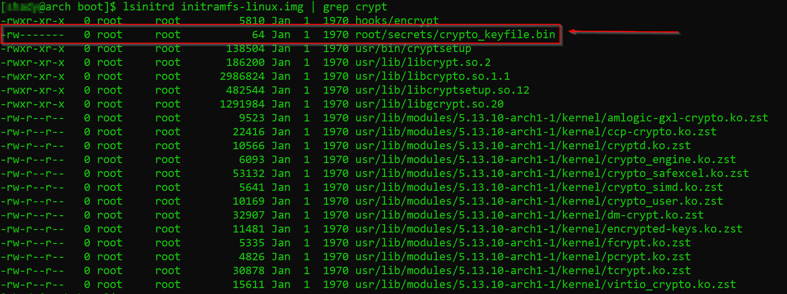
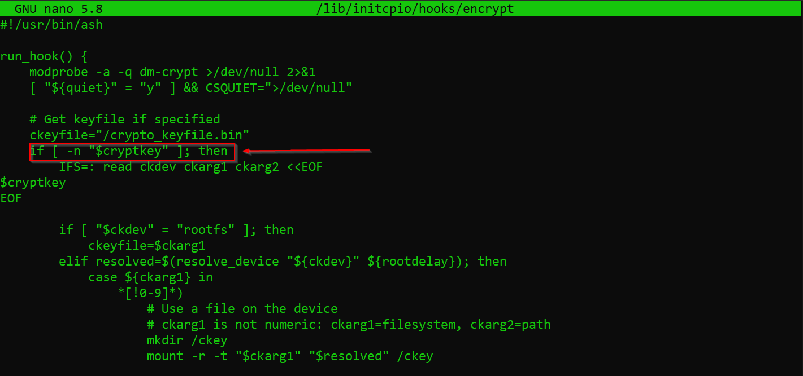






# Introduction


This is a documentation for an arch-linux installation from a security standpoint using BTRFS filesystem instead of LVM on Full Disk Encryption including /boot using LUKS.

In order to give some context and understand why we are doing this, we must first recognize the risks that we are trying to minimize & the asset that we are trying to protect:

#### Device theft leading to sensitive data exposure

* A threat actor stealing your device, getting access to your data and blackmailing you for money if they find something interesting (worth much more than the actual device).
* A threat actor stealing your device, getting access to your company files that include financials and other company secrets.
* A threat actor stealing your device, getting access to your private keys and passwords.

#### Physical access to device for a period of time

* A threat actor with physical access to your device installs a rootkit/backdoor on it.
* A threat actor with physical access to your device exfiltrates sensitive data from your disk. (worse than stealing because you would not be aware that data has been leaked)

Please keep in mind that even though we take as much security measures as we can to protect ourselves against threats, in the case of physical access to a device for a good duration of time, nothing will 100% guarantee your security but we will definetly make it extremly hard for anyone to access it :)  
<br/>

# Plan


| **partition**  | **mount**   | **Encrypted** |
|---------------|---------------|-----------|    
| /dev/sda1  | /boot/efi  |  NO |
| /dev/sda2  | /swap   |  YES   |
| /dev/sda3  | /    |  YES   |

1. Only keep /boot/efi our ESP parition unencrypted.
2. will need to decrypt at the GRUB level.
3. will need to use LUKS 1 to encrypt our system partition(since 2019 GRUB does not support LUKS2).
4. our bootloader is still an attack vector at this point, then we can address this problem by using UEFI secure boot, enroll our own Secure Boot keys and sign the kernel and GRUB with our keys.

### Note:    
>The passphrase cannot be passed on from Grub to initramfs so we will need to enter our passphrase twice: one time for grub to unlock the  encrypted root partition and another time for initramfs, the reason for that is that we currently do not have a secure way to pass our passphrase from GRUB down to initramfs unless we can embedd our secure key file in our initramfs, then we only need to enter our passphrase once. 


>The passphrase cannot be passed on from Grub to initramfs so we will need to enter our passphrase twice: one time for grub to unlock the  encrypted root partition and another time for initramfs, the reason for that is that we currently do not have a secure way to pass our passphrase from GRUB down to initramfs unless we can embedd our secure key file in our initramfs, then we only need to enter our passphrase once.


### what about SWAP?  
- we will have our swap encrypted with a random key file from /dev/urandom and reinitialized at boot (no suspend-to-disk). 


### Why BTRFS?     

 - CoW filesystem(no data loss)
- Writable snapshots and read-only snapshots
- Dynamic inode allocation
- Integrated multiple device support + RAID
- deduplication
	just to name a few...
	
	
### Few notes worth mentioning:
- practice this on a virtual machine first.
- using snapshots can be very helpful.
- documenting your steps will help you with two things: understanding better and easier  troubleshooting.
- I will be using UEFI with GPT but if you decide to go with something else please make note of the below:
	-> For [BIOS/GPT systems](https://wiki.archlinux.org/title/GRUB#GUID_Partition_Table_(GPT)_specific_instructions "GRUB") create a [BIOS boot partition](https://wiki.archlinux.org/title/BIOS_boot_partition "BIOS boot partition") with size of 1 MiB for GRUB to store the second stage of BIOS bootloader. Do not mount the partition. For BIOS/MBR systems this is not necessary.
	-> For [UEFI systems](https://wiki.archlinux.org/title/GRUB#UEFI_systems "GRUB") create an [EFI system partition](https://wiki.archlinux.org/title/EFI_system_partition "EFI system partition") with an appropriate size, it will later be mounted at /boot/efi

<br/>

# Installation


- Download arch linux installation image from [here](https://archlinux.org/download/)

- Verify signature
`gpg --keyserver-options auto-key-retrieve --verify archlinux-_version_-x86_64.iso.sig`

- Prepare an installation media

- Boot into the live enviroment

- OPTIONAL:

personally i like to ssh into the device because it allows me to do the installation  & read documentation from the same workstation, i can also copy and paste into it from my clipboard, zoom in, etc.. sshd should be enabled and started but otherwise you can use:

* `systemctl start sshd` to start the ssh daemon.
* `ip a s` to take note of the device's ip address.
* `passwd` to reset root's password.
* `ssh root@ip` ssh into it.

- Set the keyboard layout:

`loadkeys us`

- verify that we have booted into UEFI mode

`ls /sys/firmware/efi/efivars`

-> Update the system clock
`timedatectl set-ntp true`

-> Make sure you have internet access

`ping archlinux.org`

-> Let's first start by securely wiping our device:

`cryptsetup open --type plain -d /dev/urandom /dev/<block-device> to_be_wiped`

-> You can verify that it exists:

```
 lsblk

NAME          MAJ:MIN RM  SIZE RO TYPE  MOUNTPOINT
sda             8:0    0  1.8T  0 disk
└─to_be_wiped 252:0    0  1.8T  0 crypt
```

-> Wipe the container with zeros. A use of `if=/dev/urandom` is not required as the   encryption cipher is used for randomness.

```
dd if=/dev/zero of=/dev/mapper/to_be_wiped status=progress

dd: writing to ‘/dev/mapper/to_be_wiped’: No space left on device

cryptsetup close to_be_wiped
```

-> Partitioning (you can use any partitioning tool you want )

``cfdisk /dev/sda``

| **size**             | **type**  
|------------------------------|--------------------
|550MB for ESP partition     |  EFI system
|8GB for swap partition       |    Linux swap
|the rest for the root partition | Linux Filesystem

-> Formatting:

```
 mkfs.fat -F32 -n EFI /dev/sda1
 cryptsetup luksFormat --type luks1 --use-random -S 1 -s 512 -h sha512 -i 5000 /dev/sda3 
 cryptsetup luksOpen /dev/sda3 cryptroot
 cryptsetup open --type plain --key-file /dev/urandom /dev/sda2 swap 
 mkswap -L swap /dev/mapper/swap 
 swapon -L swap
 mkfs.btrfs --force --label cryptroot /dev/mapper/cryptroot
```

### Warning

> Notice how LUKS prompts you to enter a passphrase and not a password, [this](https://protonmail.com/blog/protonmail-com-blog-password-vs-passphrase/) is a good article that explains the difference, generally speaking humans are terrible at creating strong passwords with good entropy and remembering it and that's why we use password managers, but another option would be using passphrases 4-5 words chosen at random, example: "correct horse battery staple"

-> Creating subvolumes:

```
 mount -t btrfs -o compress=lzo /dev/mapper/cryptroot /mnt   
 cd /mnt
 btrfs subv create @  
 btrfs subv create @home
 btrfs subv create @snapshots
 umount /mnt
 o=defaults,x-mount.mkdir 
 o_btrfs=$o,compress=lzo,ssd,noatime    
 mount -o compress=lzo,subvol=@,$o_btrfs /dev/mapper/cryptroot /mnt
 mount -o compress=lzo,subvol=@home,$o_btrfs /dev/mapper/cryptroot /mnt/home
 mount -o compress=lzo,subvol=@snapshots,$o_btrfs /dev/mapper/cryptroot /mnt/.snapshots 
```

-> Mounting ESP partition

```
 mkdir -p /mnt/boot/efi
 mount /dev/sda1 /mnt/boot/efi
 ```

-> Installing packages to our new root directory /mnt

```
 pacstrap /mnt base base-devel btrfs-progs linux linux-firmware mkinitcpio nano vim dhcpcd wpa_supplicant
```  

-> fstab + crypttab

```  
  genfstab -L -p /mnt >> /mnt/etc/fstab 
  
  change this in /mnt/etc/fstab
  LABEL=swap           none       swap       defaults   0 0
  
  to this:
  /dev/mapper/swap     none       swap       sw   0 0
  
  edit crypttab:
  
swap        /dev/sda2        /dev/urandom        swap,offset=2048,cipher=aes-xts-plain64,size=256
```  

-> chroot into the new root directory

`arch-chroot /mnt /bin/bash`

-> localtime + syncing hardware clock + hostname

```
 ln -s /usr/share/zoneinfo/Europe/Paris /etc/localtime

hwclock --systohc --utc

 echo arch > /etc/hostname
 
 edit /etc/hosts file and match that accordingly 
```

-> Edit /etc/locale.gen and uncomment en_US.UTF-8 UTF-8 and other needed locales. Generate the locales by running:

 `locale-gen`

-> Installing GRUB

```
 pacman -S grub

 Edit /etc/default/grub, add GRUB_ENABLE_CRYPTODISK=y and GRUB_DISABLE_SUBMENU=y

 GRUB_CMDLINE_LINUX="cryptdevice=/dev/sda3:cryptroot:allow-discards root=/dev/mapper/cryptroot"
  
 pacman -S efibootmgr

 grub-install --target=x86_64-efi --efi-directory=/boot/efi --bootloader-id=GRUB --modules="tpm" --disable-shim-lock

 pacman -S intel-ucode

 grub-mkconfig -o /boot/grub/grub.cfg
```

-> Adding a secret key file to LUKS

```
* mkdir /root/secrets && chmod 700 /root/secrets
* head -c 64 /dev/urandom > /root/secrets/crypto_keyfile.bin && chmod 600 /root/secrets/crypto_keyfile.bin
* cryptsetup -v luksAddKey -i 1 /dev/sda3 /root/secrets/crypto_keyfile.bin
```

### Warning

>we are embedding our key file to the initramfs only because we are expected to enter our passphrase at the grub level (before initramfs and the kernel are loaded) already and a 2nd time at the initramfs level so it makes sense to embed a keyfile into our initramfs in order to avoid this redundancy.
Please do NOT embed a key file on your disk and use it to decrypt it without requiring a passphrase at an earlier level because it kind of defeats the purpose of encrypting your disk, if all that is required to decrypt it is.. booting your computer.(Unless you are storing your keyfile on a usb drive for example)

-> Add the keyfile to the initramfs image

```
/etc/mkinitcpio.conf

add encrypt just before filesystems

HOOKS=(base udev autodetect keyboard modconf block encrypt filesystems fsck)


FILES=(/root/secrets/crypto_keyfile.bin)

mkinitcpio -p linux
```
</br>
**Image below shows our crypto_keyfile embedded inside initramfs:**



-> Regenerate GRUB

```
Edit /etc/default/grub again

GRUB_CMDLINE_LINUX="... cryptkey=rootfs:/root/secrets/crypto_keyfile.bin"

grub-mkconfig -o /boot/grub/grub.cfg
```
</br>
**The cryptkey parameter we are passing in our grub, will be picked up by the encrypt hook that we included in our initramfs:**




### Side Note:

> But wait, how can we decrypt the same partition using a passphrase and then later using a keyfile with some /dev/urandom in it?!
The answer to that is: well that's how LUKS work:
>
>* it has 8 key slots stored in the partition header for multiple passphrases(for multiple users).
>* LUKS uses your passphrase to decrypt the master key which then itself is used to decrypt the bulk data, this way when you want to change your passphrase, you are only changing the encrypted masterkey and not re-encrypting the whole block device.
>
> I  recommend you to make a backup of your LUKS header
>
>`cryptsetup luksHeaderBackup --header-backup-file=testing.header testing.encrypted.iso`
>
>But enough about LUKS, let us continue with our installation

-> Create User

```
useradd -m -G wheel -s /bin/bash <user>`
passwd <user>
```


<br/>
# Post-Installation


At this point we have finished our installation, I will not go into post installation procedures because it is already covered in the Arch Linux wiki but we can confidently say that we have a fully encrypted disk by now and we have protected ourselves from data leaks in case of device theft.

Nonetheless we are still prone to other types of attacks that are a bit more advanced we call those [Evil Maid attacks](https://www.google.com/url?sa=t&rct=j&q=&esrc=s&source=web&cd=&cad=rja&uact=8&ved=2ahUKEwjDg7yot6vyAhXQBGMBHWa6CNoQFnoECAcQAQ&url=https%3A%2F%2Fen.wikipedia.org%2Fwiki%2FEvil_maid_attack&usg=AOvVaw03F3kBDZQof7fNW2c-wkRE), in a nutshell these are attacks that involve physical access to your encrypted device for a period of time, tampering with your initramfs file or bootloader(GRUB) in order to make reveal your password in cleartext on a  file stored on the unencrypted partition of your disk(/boot or /boot/efi or /efi) or sent over the internet to the attacker, who later on can come back and access your device using the passphrase that he retreived.

If you are using UEFI then one way to protect ourselves against these attacks is to use Secure boot, then we can only allow signed and verified binaries(bootloaders, kernel,drivers) to load on our device so any tampering with our boot process would be detected. Of course this means that you  need to protect access to your UEFI settings with a password(Otherwise attackers can just turn off secure boot altogether) and lower the boot order priority for USB.
I recommend you take a few minutes to read [this](https://www.rodsbooks.com/efi-bootloaders/secureboot.html) and also [this](https://www.rodsbooks.com/efi-bootloaders/controlling-sb.html) to understand what is going on below.

-> Install efitools

```
pacman -S efitools
```

-> Generate random GUID

```
uuidgen --random > guid.txt
```


### Please note the below:

\*.key : PEM format private keys for EFI binary and EFI signature list signing.
\*.crt : PEM format public keys for sbsign.
 \*.cer: DER format  public keys for firmware.
\*.esl: Certificates in EFI Signature List for firmware.
\*.auth: Certificates in EFI Signature List with authentication header for firmware.

* keep in mind that some UEFI firmware force you to use *.auth files
* we are changing the format of our public keys from PEM to DER to be supported by UEFI
* cert-to-efi-sig-list will convert a certificate to a EFI signature list
* sign-efi-sig-list is used to sign our EFI signature list with our private key


Before going with this manually, Rod Smith has made this [script](https://www.rodsbooks.com/efi-bootloaders/mkkeys.sh) that creates the keys that we need, it requires python3 though but we can fix this by replacing:


```
GUID=`python3 -c 'import uuid; print(str(uuid.uuid1()))'`
```

with:

```
GUID=$(uuidgen --random)
```

However if you want to proceed with creating the keys manually:

-> Generate Platform key

```
openssl req -newkey rsa:4096 -nodes -keyout PK.key -new -x509 -sha256 -days 3650 -subj "/CN=Platform Key/" -out PK.crt
openssl x509 -outform DER -in PK.crt -out PK.cer
cert-to-efi-sig-list -g "$(< guid.txt)" PK.crt PK.esl
sign-efi-sig-list -g "$(< guid.txt)" -k PK.key -c PK.crt PK PK.esl PK.auth
```

-> Generate Key Exchange Key

```
openssl req -newkey rsa:4096 -nodes -keyout KEK.key -new -x509 -sha256 -days 3650 -subj "/CN=Key Exchange Key/" -out KEK.crt
openssl x509 -outform DER -in KEK.crt -out KEK.cer
cert-to-efi-sig-list -g "$(< guid.txt)" KEK.crt KEK.esl
sign-efi-sig-list -g "$(< guid.txt)" -k PK.key -c PK.crt KEK KEK.esl KEK.auth
```

-> Generate our  Signature Database key

```
openssl req -newkey rsa:4096 -nodes -keyout db.key -new -x509 -sha256 -days 3650 -subj "/CN=Signature Database key/" -out db.crt
openssl x509 -outform DER -in db.crt -out db.cer
cert-to-efi-sig-list -g "$(< guid.txt)" db.crt db.esl
sign-efi-sig-list -g "$(< guid.txt)" -k KEK.key -c KEK.crt db db.esl db.auth
```

-> make sure to restrict permissions on our private keys:

`chmod 0600 *.key`

-> Install sbsigntools to sign our binaries

```
pacman -S sbsigntools
```

-> Signing our kernel and GRUB binary

```
sbsign --key db.key --cert db.crt --output /boot/vmlinuz-linux /boot/vmlinuz-linux
sbsign --key db.key --cert db.crt --output /boot/efi/EFI/GRUB/grubx64.efi /boot/efi/EFI/GRUB/grubx64.efi
```

-> Automatically sign bootloader and kernel on install and updates

It is necessary to sign GRUB with your UEFI Secure Boot keys every time the system is updated via `pacman`. This can be accomplished with a [pacman hook](https://jlk.fjfi.cvut.cz/arch/manpages/man/alpm-hooks.5).

-> Create the hooks directory

```
mkdir -p /etc/pacman.d/hooks
```

-> Create hooks for both the `linux` and `grub` packages

`/etc/pacman.d/hooks/99-secureboot-linux.hook`

```
[Trigger]
Operation = Install
Operation = Upgrade
Type = Package
Target = linux

[Action]
Description = Signing Kernel for SecureBoot
When = PostTransaction
Exec = /usr/bin/find /boot/ -maxdepth 1 -name 'vmlinuz-*' -exec /usr/bin/sh -c 'if ! /usr/bin/sbverify --list {} 2>/dev/null | /usr/bin/grep -q "signature certificates"; then /usr/bin/sbsign --key /root/db.key --cert /root/db.crt --output {} {}; fi' \ ;
Depends = sbsigntools
Depends = findutils
Depends = grep
```

`/etc/pacman.d/hooks/98-secureboot-grub.hook`

```
[Trigger]
Operation = Install
Operation = Upgrade
Type = Package
Target = grub

[Action]
Description = Signing GRUB for SecureBoot
When = PostTransaction
Exec = /usr/bin/find /boot/efi/ -name 'grubx64*' -exec /usr/bin/sh -c 'if ! /usr/bin/sbverify --list {} 2>/dev/null | /usr/bin/grep -q "signature certificates"; then /usr/bin/sbsign --key /root/db.key --cert /root/db.crt --output {} {}; fi' \ ;
Depends = sbsigntools
Depends = findutils
Depends = grep
```

-> Copy  `*.cer`, `*.esl`, `*.auth` to the ESP partition

```
cp /root/*.cer /root/*.esl /root/*.auth /boot/efi/
```

-> Boot into UEFI firmware setup

```
systemctl reboot --firmware
```

-> clear all preloaded keys to get into "Setup" mode
-> add our newly created keys starting with db then KEK then finally PK
-> after booting and making sure that everything works fine, please make sure to shred the keys that we copied into our ESP partition(remember this is an unencrypted parition)

```
shred -uzv *.cer
shred -uzv *.esl
shred -uzv *.auth
```

-> Grub password protection (Additional protection)

`grub-mkpasswd-pbkdf2`
`sudo nano /etc/grub.d/00_header`

```
cat << EOF
set superusers="admin"
password_pbkdf2 admin HASH
EOF
```

where HASH is the hash generated earlier

`sudo update-grub`

# Conclusion

Personally i think there is never a good reason to not encrypt your data if you care about it, just like there is never a good reason to use HTTP over HTTPS or to send out an unencrypted email, encrypting data-at-rest is just as important as encrypting data-in-transit.
Windows did a good job by implementing Bitlocker for drive encryption, TPM, Secure Boot, Trusted Boot, Measured Boot all to prevent bootkits, rootkits and any kind of tampering with the boot process and we have taken a similar approach with our Arch Linux Installation to protect ourselves against those attacks.

--------------------------
<br/>
Chady MORRA, 8/14/2021
